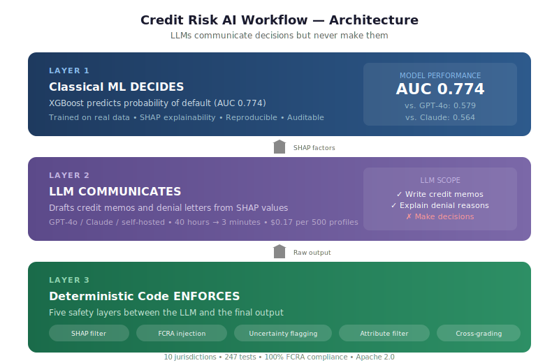

# Credit Risk AI Workflow

**A production-ready architecture for AI in credit underwriting — where LLMs communicate decisions but never make them.**

[](LICENSE)
[](https://www.python.org/downloads/)
[](tests/)
[](workflow/jurisdictions/)
[](verification/verification_report.md)

---

## The Problem

Banks are adopting AI chatbots (GPT-4o, Claude, etc.) for credit decisions. Our research on 500 borrower profiles shows why this is dangerous:

| Approach | AUC | Education Bias | FCRA Compliance |
|---|---|---|---|
| XGBoost alone | 0.774 | N/A (no communication) | N/A |
| GPT-4o zero-shot | 0.579 | **FAILS** (DI 0.49) | 43% |
| GPT-4o + skill prompt | 0.667 | Still fails (DI 0.70) | Uncontrolled |
| **This workflow** | **0.774** | N/A (XGBoost decides) | **100%** |

Chatbots score barely above a coin flip on structured credit data and exhibit "selective fairness" — fair on gender (where safety training applies) but biased on education and age (where it doesn't).

## The Solution

Don't make the chatbot smarter at credit. Make it do what it's actually good at:

<p align="center">
  
</p>

This is what Moody's, Rocket Mortgage, and HSBC already do. This repo makes it reproducible and open.

## Quick Start

```bash
git clone https://github.com/maneek21/credit-risk-ai-workflow.git
cd credit-risk-ai-workflow
pip install -r requirements.txt
cp .env.example .env  # Add your API keys
```

### Train Your Own Model

A configurable training SDK ships three sample datasets, each paired
with a YAML config. Train end-to-end with one command — model,
metrics, fairness report, and SHAP summary all written to disk.

| Dataset | Region | Rows (sampled) | Protected attributes | Pre-trained |
|---|---|---|---|---|
| UCI Default of Credit Card Clients | Taiwan (TW) | 30,000 | SEX, AGE_BUCKET | ✅ `models/uci_xgboost_v1.joblib` |
| HMDA Mortgage (NY 2022) | United States (US) | 100,000 | derived_race, derived_ethnicity, derived_sex, applicant_age | ✅ `models/hmda_xgboost_v1.joblib` |
| Bondora P2P | Estonia / EU | ~100,000 | Gender, Country, Age | ⏳ requires Kaggle CLI auth — see `data/README.md` |

```bash
# Use a pre-trained model immediately (zero training):
python -c "
from workflow import CreditWorkflow, US
wf = CreditWorkflow(model_path='models/uci_xgboost_v1.joblib', jurisdiction=US())
print('Ready to process applications')
"

# Or train your own from a YAML config:
python -m workflow.training train --config configs/uci_us.yaml
python -m workflow.training train --config configs/hmda_us.yaml
python -m workflow.training train --config configs/bondora_eu.yaml

# Or download a built-in dataset:
python -m workflow.training download --dataset hmda --dest data/raw/

# Or bring your own data:
# See examples/bring_your_own_data/README.md for the 5-step guide.
```

The SDK is **opt-in**. If you already have a trained model, just pass
its path to `CreditWorkflow` directly — the SDK is purely an
onboarding accelerator. Protected attributes are reserved for fairness
evaluation only and are statically separated from model features at
the adapter contract level (`DatasetMetadata.validate()` raises if
they overlap).

### Run the benchmark (reproduce our findings)

```bash
cd benchmarks
python src/train_classical.py          # Train XGBoost/LR/MLP
python src/llm_zero_shot_eval.py       # Test chatbots on credit decisions
python src/llm_skill_eval.py           # Test with enhanced instructions
python src/workflow_eval.py            # Run the full workflow pipeline
```

### Use the workflow in your project

```python
from workflow import CreditWorkflow
from workflow.audit import AuditLogger
from workflow.pii import PIIScrubber
from workflow.escalation import EscalationRouter

wf = CreditWorkflow(
    model_path="your_xgboost_model.joblib",
    llm_provider="openai",       # or "anthropic" or self-hosted
    llm_model="gpt-4o",
    model_version="1.0.0",
    audit_logger=AuditLogger(backend="jsonl", path="./audit_logs/"),
    pii_scrubber=PIIScrubber(mode="feature_only"),
    escalation_router=EscalationRouter(backend="queue"),
)

result = wf.process_application(applicant_data)
# result.decision        → "APPROVE" or "DENY"
# result.memo            → Full credit memo (SHAP-grounded)
# result.adverse_action  → Denial letter (if denied, FCRA-compliant)
# result.flags           → ["BORDERLINE", "PROTECTED_ATTR_DETECTED"]
# result.metadata        → {decision_id, model_version, processing_time_ms, ...}
```

## The Six Phases

| Phase | What it does | Tool | Why not the other? |
|---|---|---|---|
| 01 | Document extraction | LLM | Unstructured PDFs → structured fields |
| 02 | Default prediction | XGBoost | 20 AUC points above best chatbot |
| 03 | Credit memo drafting | LLM + SHAP | 40 hours → 3 minutes (Moody's benchmark) |
| 04 | Fairness audit | Deterministic | Must be exact, reproducible, auditable |
| 05 | Adverse action notices | LLM + code | LLM writes, code injects FCRA disclosures |
| 06 | Drift monitoring | Deterministic | SR 11-7 requires precise temporal tracking |

Each phase is independent — invoke only what you need.

## Safety Layers

Five mechanisms between the chatbot and the final output:

1. **SHAP filter** — chatbot may only cite factors SHAP identifies as influential
2. **FCRA injection** — legal disclosures inserted by code (100% compliance)
3. **Uncertainty flagging** — borderline cases routed to human review (10.2% of cases)
4. **Protected attribute filter** — catches race/gender/age mentions before output (caught 24/500 in testing)
5. **Cross-model grading** — independent AI grades the output (reveals 9.2-point self-grading bias)

## Key Research Findings

Our benchmark tested 4 LLMs × 500 profiles × 2 runs = 4,000+ API calls:

- **Chatbots can't predict credit** — best AUC: 0.580 (XGBoost: 0.774)
- **"Selective fairness"** — all pass on gender, all fail on education/age
- **Same prompt, opposite effects** — GPT-4o education DI improved (0.39→0.70), Claude's worsened (0.51→0.37)
- **Self-grading is unreliable** — 9.2-point inflation on a 25-point scale
- **The workflow works** — 100% FCRA compliance, 0 protected attribute leaks, 97% SHAP adherence

Full methodology and results: [`docs/research_paper.md`](docs/research_paper.md) | Quick summary: [`FINDINGS.md`](FINDINGS.md)

## Production Components

Beyond the core pipeline, this repo includes 10 production-readiness components:

| Component | File | What it does |
|---|---|---|
| Audit trail | `workflow/audit.py` | Immutable decision logging (JSONL + SIEM backends) |
| PII scrubber | `workflow/pii.py` | Strips personal data before LLM calls (GLBA compliance) |
| Model registry | `workflow/registry.py` | Versioned models with lineage tracking (SR 11-7) |
| Escalation router | `workflow/escalation.py` | Routes flagged cases to human review (queue + webhook) |
| Rate limiter | `workflow/ratelimit.py` | Token bucket + circuit breaker + cost cap |
| Drift monitor | `workflow/monitoring.py` | PSI, AUC drift, approval-rate alerts |
| Batch processor | `workflow/batch.py` | Concurrent processing with checkpoint resume |
| Config manager | `workflow/config.py` | Layered config (env > .env > yaml > defaults) |
| Safety tests | `tests/` | 247 tests covering all safety-critical paths |
| MRM validation | `docs/model_validation_report.md` | 8,200-word SR 11-7 / OCC 2011-12 template |
| Jurisdictions  | `workflow/jurisdictions/` | Pluggable region-specific regulatory modules (10 markets) |
| Training SDK   | `workflow/training/` + `data/adapters/` | YAML-driven training pipeline; UCI / HMDA / Bondora adapters |

## Supported Jurisdictions

The pipeline ships with pluggable jurisdiction modules that swap the
disclosure block, protected-attribute keyword list, fairness threshold,
explainability requirement, and data-residency posture per market. Pass
`jurisdiction=UK()` (or any other) into `CreditWorkflow` to switch. The
default is `US()` so existing callers see byte-identical behaviour.

```python
from workflow import CreditWorkflow, UK
wf = CreditWorkflow(model_path="model.joblib", jurisdiction=UK())
```

| Market | Code | Module | Primary regulator | Key laws | Status |
|---|---|---|---|---|---|
| United States   | US | `jurisdictions.US()`        | CFPB         | FCRA, ECOA / Reg B, SR 11-7                                | ✅ |
| United Kingdom  | UK | `jurisdictions.UK()`        | FCA          | Consumer Credit Act 1974, Equality Act 2010, Consumer Duty | ✅ |
| European Union  | EU | `jurisdictions.EU()`        | EBA + NCAs   | EU AI Act, GDPR, Consumer Credit Directive 2023/2225       | ✅ |
| India           | IN | `jurisdictions.India()`     | RBI          | RBI Fair Practices Code, DPDPA 2023, CICRA 2005            | ✅ |
| Canada          | CA | `jurisdictions.Canada()`    | OSFI         | Bank Act, CHRA (13 grounds), PIPEDA, OSFI E-23             | ✅ |
| Australia       | AU | `jurisdictions.Australia()` | APRA         | NCCP Act, Privacy Act 1988, APRA CPS 230                   | ✅ |
| Singapore       | SG | `jurisdictions.Singapore()` | MAS          | MAS FEAT, MAS AI Guidelines (2025), PDPA 2012              | ✅ |
| Japan           | JP | `jurisdictions.Japan()`     | FSA          | Banking Act, Instalment Sales Act, APPI                    | ✅ |
| United Arab Emirates | AE | `jurisdictions.UAE()`  | CBUAE        | Federal Decree-Law 6/2025, CBUAE Enabling-Tech Guidelines, PDPL | ✅ |
| Brazil          | BR | `jurisdictions.Brazil()`    | BCB          | LGPD (Art 20 right-to-review), CDC, Cadastro Positivo      | ✅ |

Region-specific highlights:

- **EU** flags as `ALGORITHMIC` explainability (AI Act Art 13), requires human review (Art 14), requires model registration (Art 49), and emits a data-residency warning when the configured LLM endpoint is outside the EEA.
- **India** is the only market with `data_residency_required=True` (RBI 2018 data-localisation circular).
- **India** keyword list adds `caste`, `dalit`, `scheduled caste`, `scheduled tribe`, `OBC` — terms a Western-trained LLM may not flag on its own.
- **Canada** keyword list reflects the **13** Canadian Human Rights Act grounds, including `gender identity`, `family status`, `genetic characteristics`, and `pardoned conviction`.
- **Brazil** disclosure block cites **LGPD Article 20** — the right to request review of automated decisions — which is the closest non-EU analogue to GDPR Art 22.
- **Japan** uses the APPI "special care-required" framing (`creed`, `social status`, `family origin`, `medical history`, `criminal record`, `burakumin`) which differs in scope from GDPR Art 9 special categories.
- **UAE** is dual-track: onshore CBUAE rules vs ADGM-FSRA / DFSA in free zones; Islamic-finance structures (murabaha, ijara) are accommodated in the template note.

The disclosure templates are plain text under `workflow/jurisdictions/templates/` so qualified counsel can review and edit per market without touching Python. Each template is paired with a `mandatory_disclosures` substring list that `validate_notice()` checks against — every shipped template clears its own check (parameterized test).

> **Legal disclaimer.** These templates are reference text for engineering and research use, not legal advice. Any institution deploying this in production must have the per-market disclosures reviewed by qualified counsel in each jurisdiction. Regulations change frequently; templates reflect law as of April 2026.

## Project Structure

```
credit-risk-ai-workflow/
├── workflow/                    # The reusable Python module
│   ├── __init__.py             # CreditWorkflow API
│   ├── pipeline.py             # Core orchestration
│   ├── audit.py                # Immutable audit trail
│   ├── pii.py                  # PII scrubber (GLBA boundary)
│   ├── registry.py             # Model versioning + CLI
│   ├── escalation.py           # Human-in-the-loop routing
│   ├── ratelimit.py            # Rate limiting + cost control
│   ├── monitoring.py           # Drift detection + alerts
│   ├── batch.py                # Batch processing engine
│   ├── config.py               # Configuration management
│   ├── jurisdictions/          # Pluggable per-market regulatory modules (10)
│   │   ├── base.py             # JurisdictionBase + ExplainabilityLevel
│   │   ├── us.py uk.py eu.py india.py canada.py australia.py
│   │   ├── singapore.py japan.py uae.py brazil.py
│   │   └── templates/          # Plain-text disclosure templates per market
│   ├── training/               # Configurable training SDK
│   │   ├── pipeline.py         # TrainingPipeline + TrainingConfig + TrainingResult
│   │   ├── datasets.py         # DatasetAdapter ABC + adapter resolver
│   │   ├── evaluation.py       # AUC/KS/Brier/ECE + fairness + SHAP
│   │   └── cli.py              # python -m workflow.training (argparse)
│   ├── phases/                 # Phase documentation (01-06)
│   ├── scripts/                # Python implementations
│   ├── prompts/                # LLM prompt templates
│   └── references/             # Regulatory context, schemas
├── benchmarks/                 # Reproduce our research
│   ├── data/                   # Sample data + download scripts
│   ├── results/                # Pre-computed results (10 CSVs)
│   └── src/                    # Benchmark scripts
├── configs/                    # Sample YAML configs for the training SDK
│   ├── uci_us.yaml             # UCI + US jurisdiction
│   ├── hmda_us.yaml            # HMDA NY 2022 + US (canonical fairness benchmark)
│   └── bondora_eu.yaml         # Bondora P2P + EU
├── data/                       # Built-in dataset adapters + download utilities
│   ├── adapters/               # UCIAdapter, HMDAAdapter, BondoraAdapter
│   ├── download.py             # Unified downloader CLI
│   └── README.md               # Data dictionary + download instructions
├── models/                     # Pre-trained model artifacts (.joblib + metrics JSON)
├── verification/               # End-to-end verification (500 profiles)
├── tests/                      # 247 unit + integration tests (104 core + 103 jurisdictions + 40 training)
├── examples/                   # Usage examples
├── docs/                       # Research paper + MRM validation doc
├── .github/workflows/          # CI (lint + test, Python 3.10-3.12)
├── requirements.txt
├── LICENSE                     # Apache 2.0
└── README.md
```

## Requirements

- Python 3.10+
- OpenAI or Anthropic API key (for LLM communication layer) — or self-hosted LLM endpoint
- A trained credit model (we include a pre-trained XGBoost on UCI data for demo)

## Citation

If you use this workflow or benchmark in your research:

```bibtex
@misc{mohan2026creditworkflow,
  title={AI in Credit Risk Assessment: Where Do LLMs Actually Belong in the Credit Pipeline?},
  author={Mohan, Maneek},
  year={2026},
  url={https://github.com/maneek21/credit-risk-ai-workflow},
  note={Research-backed credit underwriting workflow}
}
```

## License

Apache 2.0 — see [LICENSE](LICENSE).

## Verified End-to-End

We ran 500 borrower profiles through the complete pipeline with all production components active. [Full verification report →](verification/verification_report.md)

| Check | Result |
|---|---|
| Success rate | 500/500 (100%) |
| AUC | 0.7769 |
| FCRA coverage | 102/102 denials (100%) |
| Audit trail coverage | 500/500 records (100%) |
| Total LLM cost | $0.17 (gpt-4o-mini) |

## Contributing

See [CONTRIBUTING.md](CONTRIBUTING.md). We welcome:
- Additional LLM benchmarks (Gemini, Llama, Mistral, self-hosted models)
- Integration with other credit models (LightGBM, CatBoost)
- Additional jurisdictions beyond the 10 currently shipped (see `docs/development/MULTI_JURISDICTION_PLAN.md` for the pattern)
- Production deployment guides (Docker, Kubernetes, cloud-specific)

---

*"The credit industry doesn't need to choose between AI and traditional models. It needs to assign each tool to what it does best."*
